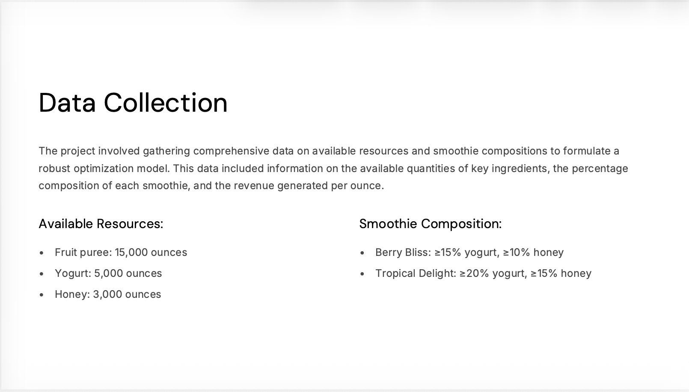
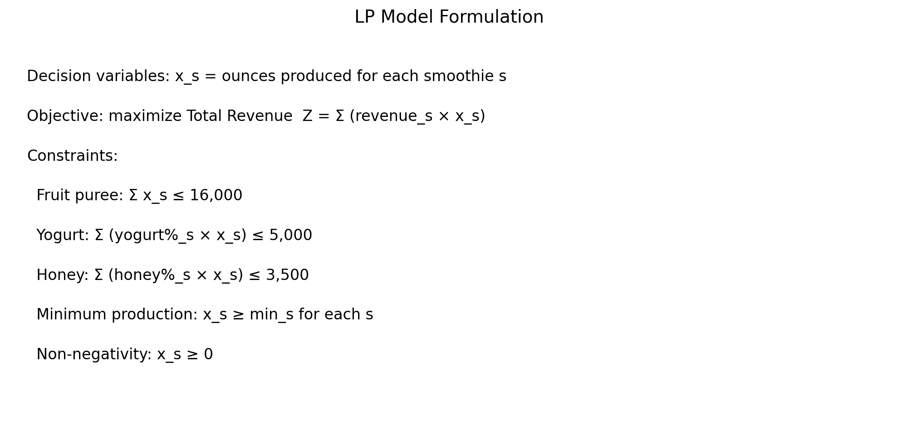
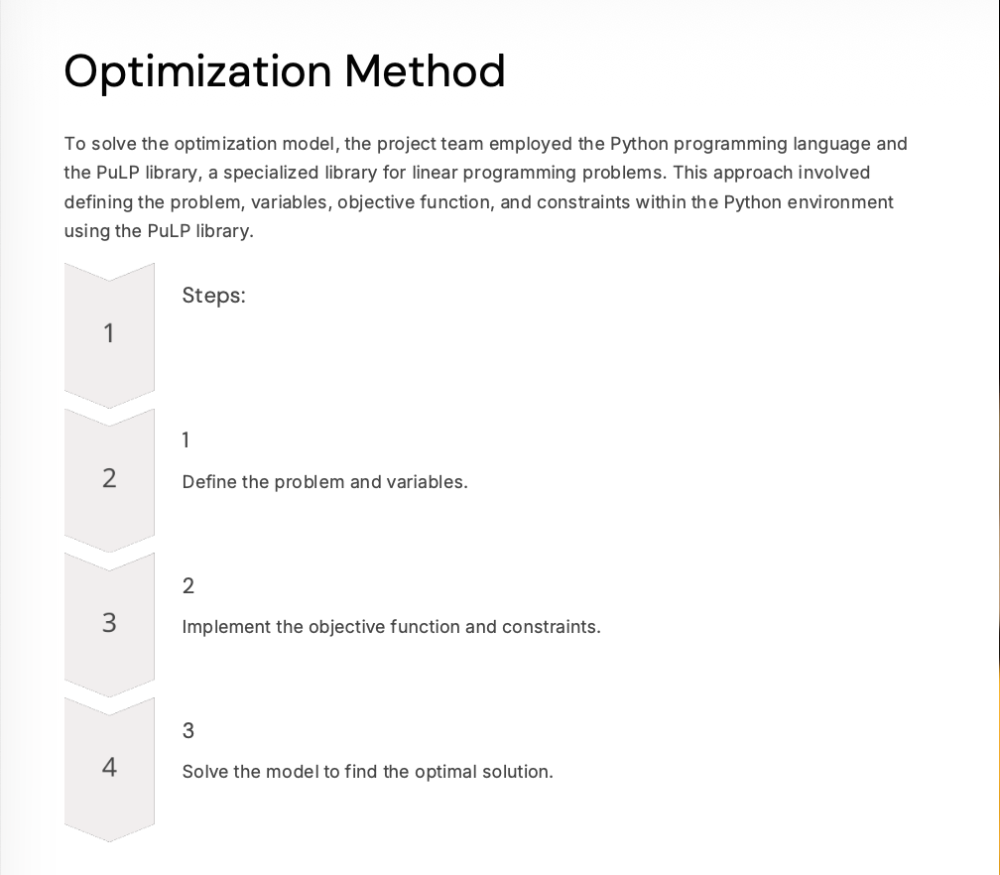
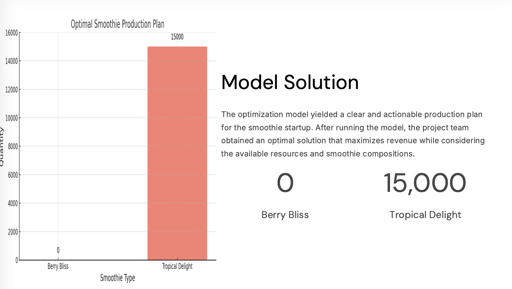
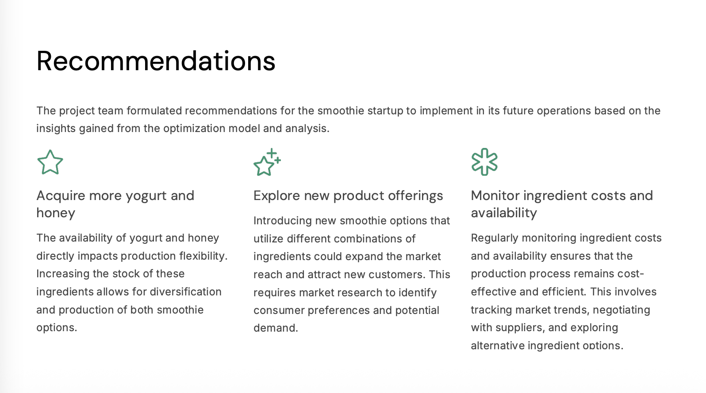

# Smoothie Production Optimization (Linear Programming / PuLP)

Built a linear programming model to maximize smoothie revenue under ingredient and recipe constraints, and generated an optimal production plan using Python (PuLP).

## Business Objective
Maximize revenue while meeting ingredient availability and recipe composition requirements.

## Data & Constraints
- Ingredients: fruit puree, yogurt, honey
- Recipe composition constraints for Berry Bliss and Tropical Delight
- Resource limits and non-negativity constraints

## Approach
- Formulated an LP model (decision variables, objective, constraints)
- Implemented and solved using Python + PuLP

## Result
Optimal plan produced **15,000 oz Tropical Delight** and **0 oz Berry Bliss** under the given constraints.

## Recommendations
Increase yogurt/honey capacity, explore new SKUs, and monitor ingredient cost/availability.

## Key Visuals

## Files
- Slide deck: [smoothie_optimization_deck.pdf](docs/smoothie_optimization_deck.pdf)
- Notebook: [shake_smart.ipynb](notebooks/shake_smart.ipynb)
