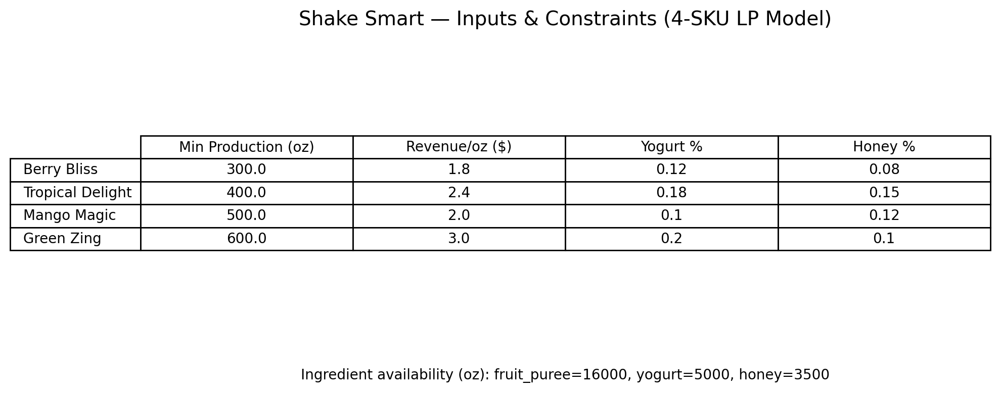
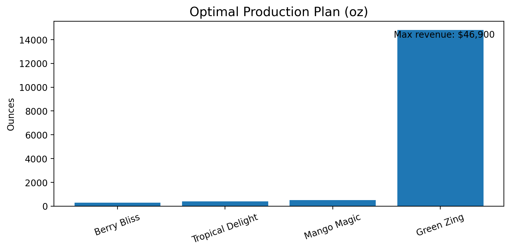
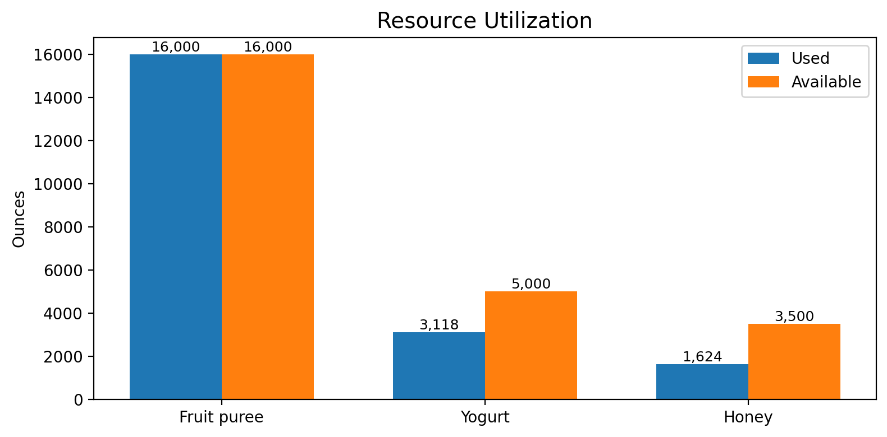

# Shake Smart Production Optimization (4-Smoothie LP / PuLP)

Built a linear programming (LP) model to optimize smoothie production across **4 SKUs** under ingredient availability and recipe constraints. Implemented in **Python (PuLP)** and used what-if/sensitivity analysis to support planning decisions.

## Business Objective
Maximize revenue/profit while meeting ingredient constraints and product mix requirements.

## Model Scope
- Products: Berry Bliss, Tropical Delight, Mango Magic, Green Zing
- Constraints: ingredient availability + recipe requirements + non-negativity
- Output: optimal production quantities + KPI summary (revenue/profit, capacity utilization)

## Approach
- Converted business rules into LP decision variables, objective function, and constraints
- Solved using PuLP and validated feasibility
- Ran what-if/sensitivity scenarios to test cost/demand/availability changes

## Files
- Notebook: [shake_smart.ipynb](notebooks/shake_smart.ipynb%202)

## Key Visuals

